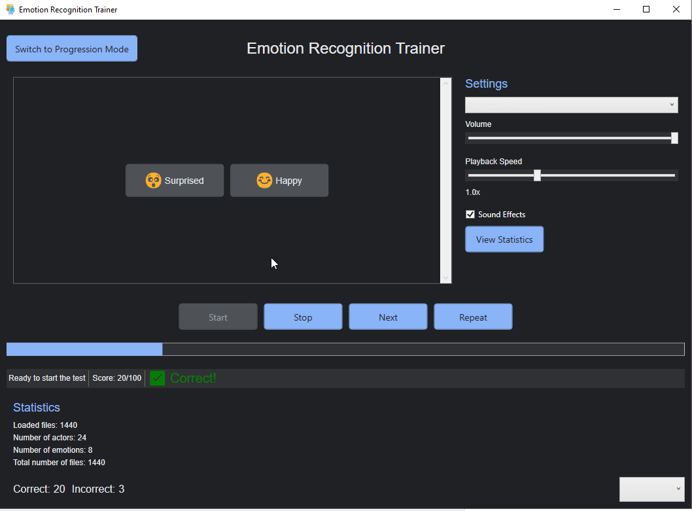

# Тренировка распознавания эмоций

## Установка

1. Скачайте аудиофайлы в формате .wav из одного из следующих источников:
   - [Zenodo RAVDESS dataset](https://zenodo.org/records/1188976)
   - [Zenodo RAVDESS Speech 16K dataset](https://zenodo.org/records/11063852)

2. Запустите приложение `JsonDataGenerator` и выберите папку с аудиофайлами, которые вы скачали.

3. Нажмите кнопку "Save JSON" и сохраните файл `ravdess_data.json` в папку с проектом.

4. Откройте решение в Visual Studio и запустите приложение `VoiceMood_Trainer`.

## Использование

1. В главном окне приложения `VoiceMood_Trainer` вы увидите кнопки с различными пресетами эмоций.

2. Выберите интересующий вас пресет и нажмите кнопку "Начать".

3. Приложение начнет воспроизводить аудиозаписи с голосовыми образцами эмоций. Ваша задача - выбрать соответствующую эмоцию, нажав на одну из кнопок.

4. После ответа на каждый вопрос, вы получите обратную связь о правильности ответа.

5. В нижней части окна отображается ваш текущий счет, а также статистика по пройденному тесту.

6. Кнопка "Далее" позволяет перейти к следующему аудиофайлу, а кнопка "Повторить" - повторить текущий аудиофайл.

7. Вы можете в любой момент остановить тест, нажав кнопку "Остановить".

8. Приложение также имеет режим "Прогрессии", который позволяет вам выбрать набор эмоций для тестирования. Для перехода в этот режим нажмите кнопку "Перейти в режим прогрессии".

9. В режиме "Прогрессии" вы можете выбрать интересующие вас эмоции и начать тестирование. Статистика по пройденным тестам доступна в окне "Статистика эмоций".

10. Вы можете изменить язык интерфейса с помощью выпадающего списка в правом нижнем углу окна.

## Поддерживаемые языки

Приложение поддерживает следующие языки:

- Арабский (ar.json)
- Бенгальский (bn.json)
- Немецкий (de.json)
- Английский (Австралия) (en-AU.json)
- Английский (en.json)
- Испанский (Мексика) (es-MX.json)
- Испанский (es.json)
- Французский (Канада) (fr-CA.json)
- Французский (fr.json)
- Хинди (hi.json)
- Индонезийский (id.json)
- Итальянский (it.json)
- Японский (ja.json)
- Корейский (ko.json)
- Португальский (Бразилия) (pt-BR.json)
- Португальский (pt.json)
- Русский (ru.json)
- Украинский (uk.json)
- Китайский (Китай) (zh-CN.json)

## Особенности

- Приложение использует библиотеку NAudio для воспроизведения аудиофайлов.
- Для отображения эмоций используются векторные SVG-изображения.
- Приложение сохраняет статистику по пройденным тестам в файле `emotion_statistics.json`.
- Локализация интерфейса реализована с помощью словарей ресурсов.